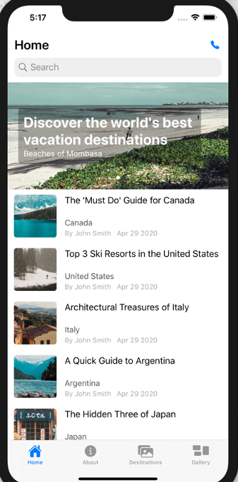
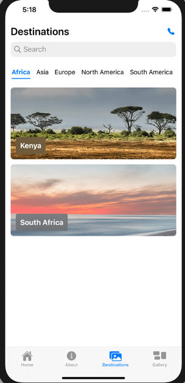
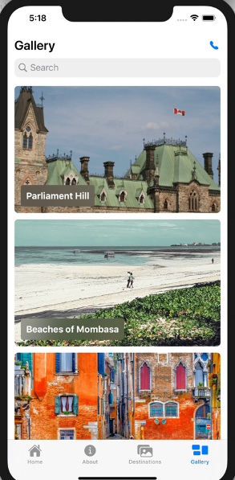

# sample-traveler-ios-app

This is a native iOS mobile app for a fictitious "Traveler" company, using content and assets from Acoustic Content. This is a companion sample to [sample-react-traveler-website](https://github.com/acoustic-content-samples/sample-react-traveler-website), and it uses the content and assets from that sample. A third sample, [sample-traveler-android-app](https://github.com/acoustic-content-samples/sample-traveler-android-app), shows the same content in a native Android app.

Together these samples illustrate the value of a headless CMS: all the content and assets are managed in one place for all three channels. Whenever a business user creates and publishes new content, it's immediately available in all three channels.

Here are a few of the screens from the sample:

</img>
</img>
</img>

## Installing the sample

### Prerequisites

In order to run this sample, the following is required:

- An Acoustic Content tenant.

- [wchtools-cli](https://github.com/ibm-wch/wchtools-cli) v2.3.4 or above.

- A recent Node 10.x LTS version of Node.

- The [Traveler Website Sample](https://github.com/acoustic-content-samples/sample-react-traveler-website) must be installed to your Acoustic Content tenant. That sample includes all the content and assets used by this sample app.

- It is recommended to have up-to-date MacOS installed.

- Xcode and Command Line Tools v 11.3 or above are installed.

- Deployment target for Xcode is set to iOS 1.32 or above.

### Download and run this sample project

1. Download or clone this repository.

2. Open AcousticContentSampleApp.xcodeproj.

3. Set the tenant information as follows:
- Open the file AcousticContentSampleApp/Data Layer/URLProvider.swift
- Update the following fields for your tenant:
	- contentHubId - with your tenant ID
	- domainName - with your hostname

4. Build and run the app.

The hostname can be extracted from the delivery URL of your tenant, (e.g. https:/hostname/content_hub_id/).

All hub information containing domain, IDs and URLs for the hub can be found inside Acoustic Content (_Sidebar > About > Hub Information_):

- Log in to Acoustic Content and open the 'About' tab.
- Click the 'Hub information' option.
- Find a delivery URL and hub ID on 'Hub Information' pop-up window.

## Resources

Acoustic Content developer documentation: https://developer.goacoustic.com/acoustic-content/docs

Acoustic Content API reference documentation: https://developer.goacoustic.com/acoustic-content/reference

Acoustic Content Samples Gallery: https://content-samples.goacoustic.com/